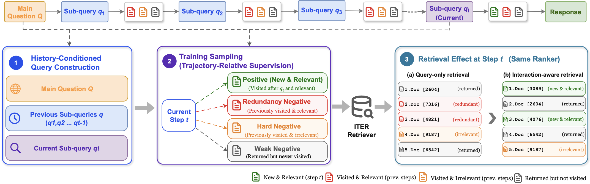

# ITER: Interaction-Aware Retrieval for Agentic Search

<p align="center">
  <a href="https://arxiv.org/abs/2608.27912">
    
  </a>
  <a href="https://huggingface.co/collections/ielabgroup/iter">
    
  </a>
  <a href="LICENSE">
    
  </a>
</p>

A deep-research agent does not search once. It issues a sub-query, reads what
comes back, and issues another — and by the eighth search only **3.9 of its 10
results** are documents it has not already been shown, while **54.9%** of the
documents it opened come back in a later search, most of them at the very top. A
retriever that sees only the current sub-query cannot tell new evidence from
evidence the agent has already consumed.

**ITER** conditions retrieval on the agent's interaction history, and learns
what to promote and what to push down from the agent's own behaviour.

<p align="center">
  
</p>

<p align="center">
  <em>ITER builds a history-conditioned query from the main question, the current
  sub-query and the previous sub-queries, and derives trajectory-relative
  supervision from the agent's document interactions. The resulting retriever
  promotes new relevant evidence and demotes documents the agent has already
  read.</em>
</p>

## The method

ITER changes two things about training a retriever from agent trajectories:

- **A history-conditioned query.** The retriever input carries the main
  question, the current sub-query, and the sub-queries already tried — a compact
  record of which directions have been explored, without the text of what was
  read.
- **Trajectory-relative supervision.** Positives are documents the agent opened
  and a verifier confirmed were useful. Negatives are split by what the agent
  had already done with them: **redundancy** (read before, and useful — the
  agent already has this), **hard** (read before, and unhelpful), **weak**
  (returned now, never opened anywhere).

Both come from the same trajectory. No external relevance judge is involved.

Across six agent backbones from three model families, ITER outperforms LRAT in
all 12 backbone × benchmark comparisons. The paper reports the full tables.

### Query representations

The ablation varies what goes into the query. `--setting` selects one, and every
CLI, checkpoint and config entry uses these names — they are the paper's
numbers, and the code carries no second numbering.

| style | query contains |
| --- | --- |
| `i0` | current sub-query only |
| `i1` | + main question |
| **`i2`** | + previous sub-queries — **the default** |
| `i3` | i2 + visited-document snippets (64 tok) |
| `i4` | i2 + post-visit notes |
| `i5` | i2 + snippets + notes |
| `i6` | AgentIR's format: pre-search reasoning + sub-query |
| `i7` | i2 + pre-search reasoning |

Full details, including the negative tiers, in
[docs/query_representations.md](docs/query_representations.md). The paper's
**redundancy** tier is the code's `div` tier (`neg_w_div`); **hard** and
**weak** keep their names.

## Start here

Look at what the retriever is actually given. This is the part people get wrong
when they reuse the checkpoint:

```bash
python run_encode.py --setting i2 \
  --question "Which Ghanaian doctor sailed on the Copacabana?" \
  --previous "Ghanaian doctors educated in Scotland" \
             "Belgian ship Copacabana passengers WWII" \
  --current  "Ghanaian doctor Edinburgh clinic 1958"
```

Then set the environment up. Python 3.11, CUDA GPUs.

```bash
export ITER_ROOT=$(pwd)

curl -LsSf https://astral.sh/uv/install.sh | sh          # install uv
uv venv envs && source envs/bin/activate
uv pip install vllm transformers accelerate datasets faiss-cpu peft \
               numpy matplotlib tqdm requests huggingface_hub \
               qwen-agent json5 tiktoken openai python-dotenv

uv pip install -e third_party/FlagEmbedding    # vendored trainer
uv pip install -e third_party/tevatron         # vendored encoder

# optional; or export FAISS_ATTN_IMPL=sdpa to run without it
uv pip install --no-build-isolation flash-attn
```

BM25 additionally needs Java 21+ (`conda install -c conda-forge openjdk=21`)
and `uv pip install pyserini`.

## Released artifacts

| | |
| --- | --- |
| Paper | [arXiv:2608.27912](https://arxiv.org/abs/2608.27912) — preprint, under review |
| Collection | [huggingface.co/collections/ielabgroup/iter](https://huggingface.co/collections/ielabgroup/iter) |
| ITER 0.6B *(default, `i2`)* | [`ielabgroup/ITER-Qwen3-Embedding-0.6B`](https://huggingface.co/ielabgroup/ITER-Qwen3-Embedding-0.6B) |
| ITER 4B | [`ielabgroup/ITER-Qwen3-Embedding-4B`](https://huggingface.co/ielabgroup/ITER-Qwen3-Embedding-4B) |

The two released checkpoints are the default query representation, `i2`. The
ablation variants are not released; `run_train.py --setting <style>` reproduces
them.

```python
from transformers import AutoModel, AutoTokenizer
model = AutoModel.from_pretrained("ielabgroup/ITER-Qwen3-Embedding-0.6B")
```

`python run_encode.py --setting i2 ...` prints the exact query and instruction
prefix this checkpoint expects.

## Data

Place these under `$ITER_ROOT`. Neither benchmark is redistributed here; both
come from their original releases.

| path | content |
| --- | --- |
| `data/corpus.jsonl` | Wiki-25 512-token chunks (11.2M) — HF: [`Lk123/wiki-25-512`](https://huggingface.co/datasets/Lk123/wiki-25-512) |
| `data/browse-comp-plus-corpus.jsonl` | BrowseComp-Plus corpus (100,195 docs) |
| `datasets/InfoSeek-Eval.tsv` | 300 InfoSeek evaluation questions |
| `datasets/topics-qrels/infoseekqa_train.tsv` | 10k InfoSeek training questions, disjoint from eval |
| `datasets/topics-qrels/queries.tsv` | 830 BrowseComp-Plus questions |
| `datasets/browsecomp-plus.tsv` | BrowseComp-Plus reference answers |
| `datasets/topics-qrels/qrel_golds.txt`, `qrel_evidence.txt` | BrowseComp-Plus qrels (TREC format) |

`python src/prepare_corpus.py --dataset Lk123/wiki-25-512 --output data/corpus.jsonl`
downloads Wiki-25 and renames its columns to the `{docid, text}` schema every
stage reads.

The agent trajectories ITER trains on are not released; stages 2 and 3 below
collect and label them from scratch.

## Running it yourself

Five stages. Each has its own document, with an argument table and a command you
can copy.

| | stage | what it produces |
| --- | --- | --- |
| 1 | [Index construction](docs/index_construction.md) | a FAISS index per retriever and corpus |
| 2 | [Trajectory construction](docs/trajectory_construction.md) | agent runs through the de-duplicated interface |
| 3 | [Training data construction](docs/training_data_construction.md) | positives and tiered negatives, then one file per query style |
| 4 | [Training](docs/training.md) | a fine-tuned retriever |
| 5 | [Evaluation and scoring](docs/evaluate.md) | one agent × retriever × benchmark arm, scored by exact match or the BrowseComp-Plus judge |

To evaluate a released checkpoint rather than train your own, you only need
stages 1 and 5.

Evaluation covers Tongyi-DeepResearch-30B, Qwen3.5-4B/9B/27B, Qwen3.6-27B and
gpt-oss-120B, on InfoSeek-Eval (300 questions, in-domain, exact match) and
BrowseComp-Plus (830 questions, out-of-domain, LLM judge), with BM25 or FAISS
retrieval.

## Where things live

| | |
| --- | --- |
| `run_encode.py`, `run_train.py`, `run_eval.py` | the three stages that take a `--setting` |
| `src/config.py` | every experimental parameter in the paper |
| `src/memory_utils.py` | builds every query representation, for extraction, training and inference alike |
| `src/data_builder.py`, `src/rebuild_query_redesign.py` | trajectories → training groups → one file per query style |
| `src/search_agent/` | agent clients, the ReAct loop, the de-duplicated search tool |
| `src/searcher/` | FAISS and BM25 backends |
| `src/index_builder.py`, `src/build_ann_index.py`, `src/index_meta.py` | encoding, HNSW, and the encoder stamp `run_eval.py` checks |
| `analysis/` | `match_eval` (InfoSeek), `evaluate` + `llm_judge_all` (BrowseComp-Plus) |
| `third_party/` | FlagEmbedding, **modified** to add the tiered negative weights and caps; tevatron, vendored upstream |

## Citation

```bibtex
@misc{chen2026iter,
  title        = {ITER: Interaction-Aware Retrieval for Agentic Search},
  author       = {Chen, Haodong and Wang, Shuai and Yin, Yu and Zhuang, Shengyao
            and Zuccon, Guido and Leelanupab, Teerapong},
  year         = {2026},
  eprint       = {2608.27912},
  archivePrefix= {arXiv},
  primaryClass = {cs.IR},
  url          = {https://arxiv.org/abs/2608.27912}
}
```

MIT licensed; see `LICENSE`.
